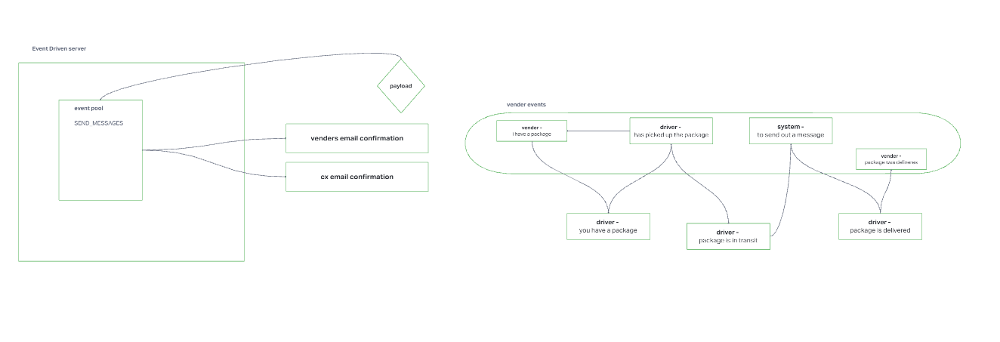

# LAB - Class 11

## Project: Event Driven Applications - CAPS

### Author: Hunter Fehr

### Problem Domain  

CAPS will simulate a delivery service where vendors (such a flower shops) will ship products using our delivery service and when our drivers deliver them, each vendor will be notified that their customers received what they purchased.

### Links and Resources

- [CAPS](https://github.com/hmfehr/caps/actions/new) (GitHub Actions)

<!-- ### Setup -->

<!-- #### `.env` requirements -->

<!-- see `.env.sample` -->

<!-- - PORT: 3001 -->

<!-- #### How to initialize/run your application -->

-

#### Features / Routes

- Feature One: create event emiter
- listen to all events in pool
- logs a timestamp

- Feature Two: deploy to prod
- pickup: when the package was picked up
- in transit: when they are in rout to cx
- delivered: notify cx delivery was completed

#### Tests

- How do you run tests?
  - npm test
- Any tests of note?
  - Write unit tests for each event handler function
  - Use spies to help testing your logger methods

#### UML

;

fixed while reviewing class zoom to re build a working example to continue working off of new material
